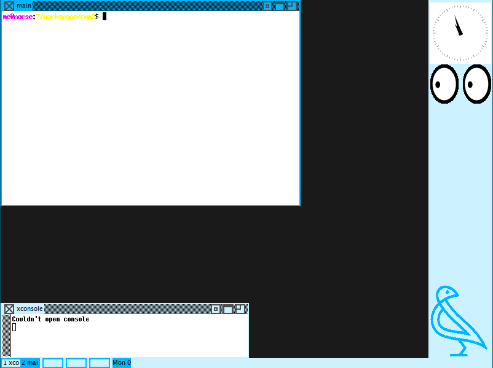

# cwm2

## cwm2 X11 Window Manager

Introducing a next-gen Unix'y Window Manager (Wm) for X11.

This projects aims to explore "new paradigms" in managing window clients under 
the X-Window System. The config is compiled a la dwm style. If you are familiar 
with dwm then it should come fairly naturally.

## So why yet another Wm?

The X-Window system could be used without a window manager. The Window Manager 
is a user-level abstraction for the X-Window System. Presented in this program 
are a combination of features that make this Wm unique. The motivation is not to 
replicate what already exists in other projects. The following are a genuinely 
unique combination of features. The codebase has been founded from first 
principles. Most importantly, the idea here has been to cast the project in such 
a way that it is relatively easy to extend. Herein is the highly modular aspect 
of the project's design. The project has to be manageable such that the user is 
not inhibited or curtailed from making modifications to it in the future. The 
project has to be simple (even dumb), clean, under control, yet useful. So what 
are the "new paradigms" I was referring to? We will come to those in due course. 
The design choices are kept natural and straightforward. We don't conform to any 
corporate or vested interests.

## Features in a nut-shell:

* No relation to cwm, but inspired by dopenbox-wm in the tradition of twm, the 
canonical Wm for the X-Window System.

* Completely new project imagined, designed & impl. from scratch.

* Borrows and improves the user experience from dwm.

* A highly modularised, "object-oriented" & extensible design.

* An integrated user-interface that uses native X-protocols.

* Integrated blocked memory management.

* A safe implementation in C.

* Tiny demands on system resources.

* Transparent performance.

* Tiling windows.

* Articulated multi-monitor support.

* Dynamic workspaces.

* Open to ricing without using patches.

* Slop free.

* Woke free.

* Cult free.

## Build prerequisites/deps:

```CC, Make, lib-X11, lib-Xinerama```

Distribution: Run ```make``` in the project's root directory. This produces the 
executable ```cwm2.bin``` which is all you need to run the program (no 
shared/dynamic libs required apart from the pre-installed system libs above).

Run ```make install``` with elevated privileges to install to the system path.

Add ```cwm2.bin``` to your user's ```.xinitrc``` and restart the X system.

## Release: rc4 (2026-02-10).

## Target(s): Any UNIX w/ X-Window System Ver. 11. 

This programs runs on (tested) FreeBSD 14.0/.3, Linux (glibc, musl).



## User's Guide:

This overarching philosophy is this Wm works on the principle of selections. You 
select a group of objects (namely clients/windows) and then apply the desired 
operation on the group. Operations are typically arrangements. It is possible to 
conceivably implement any number of operations. The default client arrangement 
is a floating layout (as opposed to, say a dynamic tiling).

The ```config.h``` file (in the root directory) initialises the Wm. The config 
is not entirely bomb-proof -- as such invalid values could result in build 
and/or runtime errors. The Wm's essential settings are implemented in the 
```calls.c``` file. It is recommended that you leave ```calls.c``` intact for 
reference, but instead add your own extensions to the ```usercalls.c``` file 
instead.

You can pin simple apps to the tray. The tray is persistant across all 
views/workspaces.

The panel shows all clients across all workspaces. It is easy to keep track of 
clients. Clients are easily switchable.

The Wm can be entirely keyboard driven.

You can print a status string to the Wm's name using the shell command:

```$ xsetroot -name "..."```

### The default Call options:

  ```.cmd = "<...>"``` Fork a command
  
  ```.call = calls_wk<...>``` Switch to a wk (between 1, 12)
  
  ```.call = calls_cli_last``` Switch to last client
  
  ```.call = calls_cli<...>``` Switch to a cli (between 1, 12)
  
  ```.call = calls_cli_next``` Switch to next client
  
  ```.call = calls_cli_prev``` Switch to prev client
  
  ```.call = calls_cli_raise_toggle``` Raise a client
  
  ```.call = calls_arrange_toggle``` Toggle client layouts (Tile/Cascade)
  
  ```.call = calls_cli_fs_toggle``` Toggle client fullscreen
  
  ```.call = calls_cli_mode_toggle``` Toggle client mode
  
  ```.call = calls_sel_toggle``` Select current client
  
  ```.call = calls_sel_clear``` Clear client selection
  
  ```.call = calls_cli_last``` Switch to last focused client
  
  ```.call = calls_wk_prev``` Switch to prev wk
  
  ```.call = calls_wk_next``` Switch to next wk
  
  ```.call = calls_wk_map``` Add a wk
  
  ```.call = calls_wk_unmap``` Remove current wk
  
  ```.call = calls_kill``` Close current client
  
  ```.call = calls_cli_wk_prev_move``` Move client to prev wk
  
  ```.call = calls_cli_wk_next_move``` Move client to next wk
  
  ```.call = calls_cli_wk<...>_move``` Move client to a wk (between 1, 12)
  
  ```.call = calls_quit``` Exit the program

The theme here is simplicity for use and maintenance, transparency, low 
maintenance, low overheads. It may be simple, but still be fun to use, and sharp 
for the job.

(C) 2023-2026 doa379
